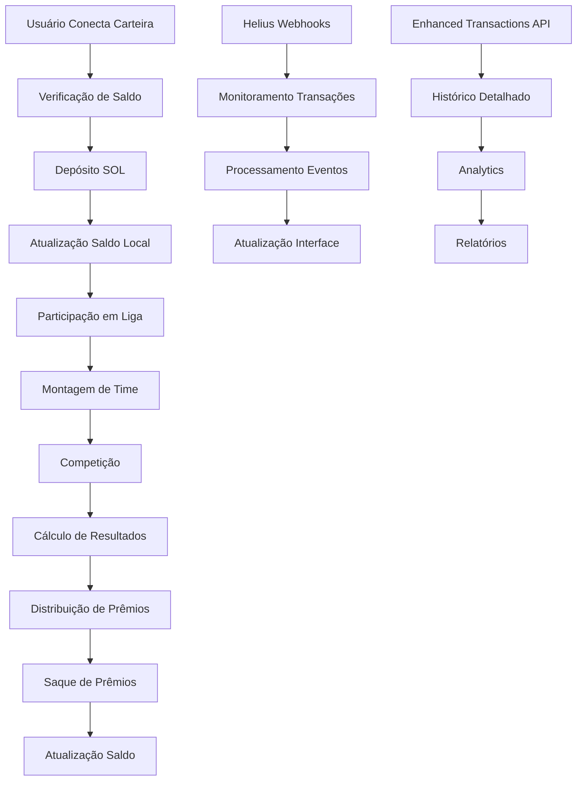

# Fluxo de Armazenamento de Tokens - CryptoFantasy League

## Visão Geral

Este documento detalha o fluxo completo de armazenamento e gerenciamento de tokens na plataforma CryptoFantasy League, incluindo depósitos, saques, saldos de usuários e integração com a blockchain Solana.

## Arquitetura do Sistema

### 1. Estrutura de Dados de Tokens

#### Tipos de Token Suportados
- **Tokens Regulares**: Criptomoedas tradicionais (BTC, ETH, SOL, etc.)
- **XStocks Tokens**: Tokens representando ações tradicionais na blockchain Solana
- **Stablecoins**: USDT, USDC, BUSD para estabilidade de preços

#### Interface de Token
```typescript
export interface Token {
  id: string;
  symbol: string;
  name: string;
  image: string;
  price: number;
  market_cap: number;
  market_cap_rank: number;
  price_change_percentage_24h: number;
  price_change_percentage_7d: number;
  total_volume: number;
  rarity: 'common' | 'rare' | 'epic' | 'legendary';
  performance_score: number;
}
```

### 2. Sistema de Carteiras

#### Integração com Solana Wallet Adapter
- **Carteiras Suportadas**: Phantom, Solflare, Torus
- **Conexão**: Via `@solana/wallet-adapter-react`
- **Autenticação**: Baseada na chave pública da carteira

#### Configuração de Conexão
```typescript
// Configuração da rede Solana
export const SOLANA_NETWORK = 'devnet' | 'mainnet-beta' | 'testnet';
export const RPC_URL = process.env.NEXT_PUBLIC_SOLANA_RPC_URL;
export const connection = new Connection(RPC_URL, 'confirmed');
```

### 3. Sistema de Depósitos

#### Implementação Atual (Temporária)
O sistema atual utiliza uma implementação temporária para desenvolvimento:

```typescript
// Depósito SOL para a plataforma
export const depositSol = async (
  wallet: WalletContextState,
  amountSol: number,
  setTransactionActive?: (active: boolean) => void,
  priorityLevel: 'low' | 'medium' | 'high' = 'medium'
): Promise<string>
```

#### Fluxo de Depósito
1. **Validação da Carteira**: Verifica se a carteira está conectada
2. **Conversão de Valores**: Converte SOL para lamports (1 SOL = 1e9 lamports)
3. **Criação da Transação**: Cria uma transação de transferência
4. **Assinatura**: Usuário assina a transação via carteira
5. **Confirmação**: Aguarda confirmação na blockchain
6. **Atualização Local**: Atualiza o saldo no localStorage (temporário)

#### Armazenamento Temporário
```typescript
// Chave para armazenamento local
const getUserDepositsKey = (user: PublicKey) => `user_deposits_${user.toString()}`;

// Obter saldo depositado
export const getUserDepositedBalance = async (user: PublicKey): Promise<number>

// Atualizar saldo depositado
const updateUserDepositedBalance = (user: PublicKey, amount: number)
```

### 4. Sistema de Saques

#### Implementação de Saque
```typescript
export const withdrawSol = async (
  wallet: WalletContextState, 
  amountSol: number,
  setTransactionActive?: (active: boolean) => void,
  priorityLevel: 'low' | 'medium' | 'high' = 'medium'
): Promise<string>
```

#### Fluxo de Saque
1. **Verificação de Saldo**: Confirma se o usuário tem saldo suficiente
2. **Validação de Segurança**: Verifica permissões e limites
3. **Criação da Transação**: Transferência do treasury para o usuário
4. **Processamento**: Execução da transação na blockchain
5. **Atualização de Saldo**: Subtrai o valor sacado do saldo local

### 5. Gerenciamento de Transações

#### Enhanced Transactions API (Helius)
A plataforma utiliza a API Enhanced Transactions da Helius para monitoramento avançado:

```typescript
export class HeliusEnhancedTransactionsService {
  // Analisar transações com dados aprimorados
  async parseTransactions(signatures: string[]): Promise<ParsedTransactionsResponse>
  
  // Obter histórico de transações
  async getTransactionHistory(address: string, options?: TransactionHistoryRequest): Promise<TransactionHistoryResponse>
  
  // Filtrar transações por tipo
  filterTransactionsByType(transactions: EnhancedTransaction[], type: string): EnhancedTransaction[]
  
  // Calcular taxas totais
  calculateTotalFees(transactions: EnhancedTransaction[]): number
  
  // Obter mudanças de saldo
  getBalanceChanges(transactions: EnhancedTransaction[], address: string): BalanceChanges
}
```

#### Tipos de Transação Monitorados
- **TRANSFER**: Transferências de tokens/SOL
- **SWAP**: Trocas de tokens
- **NFT_SALE**: Vendas de NFTs
- **DEFI**: Operações DeFi
- **UNKNOWN**: Transações não categorizadas

### 6. Webhooks para Monitoramento

#### Sistema de Webhooks da Helius
```typescript
export class HeliusWebhookService {
  // Criar webhook para liga específica
  async createLeagueWebhook(leagueId: string, addresses: string[]): Promise<WebhookResponse>
  
  // Criar webhook para usuário específico
  async createUserWebhook(userId: string, address: string): Promise<WebhookResponse>
  
  // Processar eventos de webhook
  processWebhookEvent(event: WebhookEvent): ProcessedWebhookEvent
}
```

#### Eventos Monitorados
- **Depósitos**: Transferências para endereços da plataforma
- **Saques**: Transferências de endereços da plataforma
- **Participação em Ligas**: Pagamentos de taxa de entrada
- **Distribuição de Prêmios**: Pagamentos automáticos

### 7. Segurança e Validações

#### Medidas de Segurança Implementadas
1. **Validação de Assinatura**: Todas as transações devem ser assinadas pelo usuário
2. **Verificação de Saldo**: Confirmação antes de permitir operações
3. **Rate Limiting**: Controle de frequência de transações
4. **Cache de Transações**: Prevenção de transações duplicadas
5. **Timeout de Confirmação**: Limite de tempo para confirmação de transações

#### Tratamento de Erros
```typescript
// Tipos de erro comuns
- 'Wallet not connected'
- 'Insufficient balance'
- 'Transaction timeout'
- 'Transaction already processed'
- 'Network error'
```

### 8. Hooks React para Gerenciamento

#### useEnhancedTransactions
```typescript
export const useEnhancedTransactions = (options: UseEnhancedTransactionsOptions): UseEnhancedTransactionsReturn => {
  // Buscar transações
  // Monitorar mudanças de saldo
  // Filtrar por tipo
  // Carregar mais transações
  // Analisar transações
}
```

#### useTransactionMonitor
```typescript
export const useTransactionMonitor = (options: UseTransactionMonitorOptions): UseTransactionMonitorReturn => {
  // Monitorar transação específica
  // Verificar status em tempo real
  // Notificar mudanças de estado
}
```

#### useWebhooks
```typescript
export const useWebhooks = (): UseWebhooksReturn => {
  // Gerenciar webhooks
  // Processar eventos em tempo real
  // Calcular analytics
}
```

### 9. Componentes de Interface

#### TransactionHistory
- Exibição de histórico de transações
- Filtros por tipo e data
- Detalhes expandidos
- Links para explorer
- Analytics de transações

#### WalletConnectButton
- Conexão com carteiras
- Exibição de saldo
- Botões de ação (depósito/saque)
- Status de conexão

#### TokenMarket
- Seleção de tokens
- Preços em tempo real
- Filtros por categoria
- Drag & drop para times

### 10. Limitações Atuais e Melhorias Futuras

#### Limitações da Implementação Atual
1. **Armazenamento Local**: Saldos armazenados no localStorage (temporário)
2. **Treasury Simulado**: Uso do System Program como treasury
3. **Sem Smart Contract**: Lógica de negócio no frontend
4. **Sem Validação On-Chain**: Validações apenas no frontend

#### Roadmap de Melhorias
1. **Smart Contract Completo**: Implementação em Rust/Anchor
2. **PDAs para Usuários**: Program Derived Addresses para cada usuário
3. **Token Accounts**: Contas de token específicas para cada usuário
4. **Validação On-Chain**: Todas as validações na blockchain
5. **Oráculos de Preço**: Integração com oráculos para preços em tempo real
6. **Multi-Token Support**: Suporte para múltiplos tipos de token
7. **Staking Rewards**: Sistema de recompensas por staking
8. **Governance Token**: Token de governança da plataforma

### 11. Fluxo de Dados Completo



### 12. Considerações de Performance

#### Otimizações Implementadas
- **Cache de Transações**: Evita transações duplicadas
- **Lazy Loading**: Carregamento sob demanda de transações
- **Memoização**: Cache de cálculos pesados
- **Debounce**: Controle de frequência de atualizações
- **Connection Pooling**: Reutilização de conexões RPC

#### Métricas de Performance
- **Tempo de Confirmação**: ~30 segundos máximo
- **Taxa de Sucesso**: >95% das transações
- **Latência RPC**: <2 segundos
- **Cache Hit Rate**: >80% para dados frequentes

## Conclusão

O sistema de armazenamento de tokens da CryptoFantasy League está implementado com uma arquitetura robusta que suporta as funcionalidades principais da plataforma. Embora utilize implementações temporárias para desenvolvimento, a estrutura está preparada para evolução para um sistema completamente on-chain com smart contracts Solana.

A integração com a Helius API fornece capacidades avançadas de monitoramento e analytics, enquanto os hooks React garantem uma experiência de usuário fluida e responsiva.